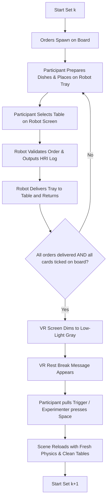

# Café HRI Experiment & Order Setup Guide

This guide is designed for researchers and experimenters managing VR trial runs in the **Café Social Robotics** project. It explains how to configure orders, set up multi-set trials, operate experimenter keyboard shortcuts, trigger distraction events, and customize session settings from a single master GameObject.

---

## Table of Contents
1. [Overview of the System](#1-overview-of-the-system)
2. [Master Experiment Control Hub (`ExperimentSessionManager`)](#2-master-experiment-control-hub-experimentsessionmanager)
3. [Master Order Setup ($N$ Sets $\times$ $M$ Orders)](#3-master-order-setup-n-sets-times-m-orders)
4. [Distraction Events & Host Hotkeys](#4-distraction-events--host-hotkeys)
5. [Trial Workflow & Transition Logic](#5-trial-workflow--transition-logic)
6. [Operator / Experimenter Keyboard Controls](#6-operator--experimenter-keyboard-controls)
7. [Saving & Resetting Progress (`PlayerPrefs`)](#7-saving--resetting-progress-playerprefs)
8. [Adding New Dish Types](#8-adding-new-dish-types)

---

## 1. Overview of the System

During each trial session, the participant stands in VR behind the café counter:
- **Order Cards** appear on the order display board at configured spawn intervals.
- The participant prepares the requested food items and places them onto the **Delivery Robot's tray**.
- The participant presses a **Table Button** on the robot to dispatch it to the destination table.
- The delivery robot validates the delivery and logs a structured **`[HRI Log]`** in the Unity console and exports CSV/JSON data.
- Once all orders in the set are fulfilled, the robot finishes delivery, and the participant ticks off all cards on the board:
  - The scene **smoothly dims to a comfortable low-light gray**.
  - A **rest break message** appears in VR.
  - The scene **reloads cleanly** for the next trial set (resetting dishes, robot joints, and tables).

---

## 2. Master Experiment Control Hub (`ExperimentSessionManager`)

All experiment parameters are centralized in the **`[ExperimentSessionManager]`** GameObject. You do not need to click through multiple objects in the hierarchy.

### Where to Find it in Unity:
In the **Hierarchy** window, select the **`ExperimentSessionManager`** GameObject.

```text
Hierarchy
 └── ExperimentSessionManager   <-- (Select this GameObject)
```

### Master Inspector Settings Overview:

| Section | Parameter | Default Value | Description |
| :--- | :--- | :--- | :--- |
| **1. Participant & Trial** | `Subject ID` | `Subject_01` | String identifier for participant tracking and file logging. |
| | `Current Set Index` | `0` | Active starting set (`0` = Set 1, `1` = Set 2, etc.). |
| | `Save To Player Prefs` | `false` *(OFF)* | If `false`, starts fresh from `Current Set Index` on Play. If `true`, remembers progress across Editor restarts. |
| **2. Workload Condition** | `Workload Condition` | `LowIntensity` | **`LowIntensity`**: Shows only calories on board and cards.<br>**`HighIntensity`**: Shows calories, sugar, and fat on board and cards. |
| **3. Master Order & Timing** | `Order Spawn Interval` | `5.0` | Number of seconds between order cards appearing on the board. |
| | `Randomize Set Order` | `false` | If `true`, sets appear in randomized sequence. |
| | `Randomize Orders Within Sets` | `false` | If `true`, individual orders within each set are shuffled. |
| | `Randomize Table Assignments` | `false` | If `true`, table destinations are randomly distributed across orders. |
| | `Available Table Indices` | `[ ]` (Empty) | Optional table index pool (e.g. `0, 1, 2` for Tables 1, 2, 3). If empty, shuffles existing tables. |
| | `Random Seed` | `0` | `0` = new random each run; `> 0` = deterministic pseudo-random sequence for repeatability across participants. |
| | `Master Order Sets` | `List` | Master order sets and nutritional limits. |
| **4. Event Hotkeys (Host PC)** | `Bottle Crash Key` | `Space` | Key pressed by experimenter to trigger broken bottle crash. |
| | `Coffee Spill Key` | `Space` | Key pressed by experimenter to trigger coffee spill distraction. |
| | `Robot Speech Input Key` | `T` | Key pressed by experimenter to open text input for custom robot speech. |
| **5. Robot & Scheduler Tuning**| `Cleanup Delay` | `5.0` | Seconds after a spill before the robot begins cleanup. |
| | `Tray Place Delay` | `1.0` | Delay before robot opens grippers to place tray at table. |
| | `Operator Mode` | `true` | Enables operator driving mode. |
| | `Robot Move / Turn Speed` | `1.2` / `90.0` | Movement speed and turn speed for manual robot controls (I/K/J/L). |
| **6. Transitions & Breaks** | `Fade Duration` | `1.0` | Duration (seconds) for dimming transition. |
| | `Min Break Duration` | `3.0` | Minimum rest time (seconds) before allowing next set to start. |
| | `Require Input To Proceed` | `true` | Requires VR Trigger or Spacebar press to end break. |
| **7. Logging & Export** | `Auto Save Incrementally` | `true` | Updates CSV/JSON exports after every order/set to prevent data loss. |
| | `Open Folder On Study Complete` | `false` | Opens Windows Explorer to `TrialLogs` upon finishing all sets. |

---

### Context Menu Shortcuts (Right-Click `ExperimentSessionManager` in Inspector)

1. **`Pull Orders from OrderManager`**:
   - Copies all existing 5 sets of orders, items, nutritional limits, table targets, and spawn intervals from the scene's `OrderManager` directly into `ExperimentSessionManager`.
   - Use this if you want to inspect or edit order sets directly inside `ExperimentSessionManager`.
2. **`Push Orders to OrderManager`**:
   - Pushes whatever orders and timing settings are configured on `ExperimentSessionManager` down to `OrderManager`.
3. **`Sync All Settings to Scene Components`**:
   - Immediately propagates all hotkeys, robot speeds, cleanup delays, and logging options across all scene components.
4. **`Reset Progress to Set 1 (Index 0)`**:
   - Clears saved set progress in PlayerPrefs and resets the scene to Set 1.
5. **`Open Trial Logs Folder`**:
   - Opens the `TrialLogs/` folder on your computer in Windows Explorer.

---

## 3. Master Order Setup ($N$ Sets $\times$ $M$ Orders)

Orders can be configured directly in **`ExperimentSessionManager`** under **`Master Order Sets`** or in **`OrderManager`**:

```text
▼ Master Order Sets             [ 5 ]
  ▼ Element 0 (Set 1)
    Set Name                     [ Set 1 - Baseline ]
    ▼ Orders                     [ 6 ]
      ▼ Element 0
        Order Title              [ Order 1 ]
        Target Table Index       [ 0 ]   <-- (0 = Table 1, 1 = Table 2, etc.)
        ▼ Required Items         [ 2 ]
          = Element 0            [ Burger ]
          = Element 1            [ Espresso ]
        ▼ Patient Nutritional Limits
          Calorie Limit          [ 500 ] <-- Displayed in Low and High Workload
          Sugar Limit            [ 30 ]  <-- Displayed in High Workload
          Fat Limit              [ 20 ]  <-- Displayed in High Workload
        Display Description      [ 1x Burger, 1x Espresso ]
```

### Table Index Mapping:
- `0` $\rightarrow$ **Table 1** (WaypointTable1)
- `1` $\rightarrow$ **Table 2** (WaypointTable2)
- `2` $\rightarrow$ **Table 3** (WaypointTable3)
*(Note: Internally 0-indexed, automatically rendered as Table 1, Table 2, Table 3 on the VR board and robot display).*

---

## 4. Distraction Events & Host Hotkeys

The host experimenter can trigger unexpected events during gameplay to measure subject response and robot interrupt handling:

1. **Broken Bottle Crash**:
   - Triggered via `Bottle Crash Key` (default: **`[Space]`**).
   - Causes a bottle to fall and shatter with sound and visual fx.
2. **Spilled Coffee Cup**:
   - Triggered via `Coffee Spill Key` (default: **`[Space]`**).
   - Spills coffee on a table, plays customer audio shouting, and places a VR indicator exclamation mark over the spill.
3. **Custom Robot Speech**:
   - Press `Robot Speech Input Key` (default: **`[T]`**) on the keyboard to open a typing prompt and have the robot speak any custom phrase.

---

## 5. Trial Workflow & Transition Logic



### When Does the Dimming / Set Transition Happen?
The set transition and dimming will **only** trigger when all of the following conditions are met:
1. **Order List is Empty**: The VR participant has ticked off all order cards on the order board (`activeOrders.Count == 0`).
2. **All Deliveries Initiated**: The robot has received all $M$ delivery dispatches for the set.
3. **Robot Delivery Completed**: The robot has arrived at the table, placed the tray down, and returned to the bar (`isActivelyDelivering == false`).

---

## 6. Operator / Experimenter Keyboard Controls

While seated at the host computer, the experimenter can control the trial using the keyboard at any time:

| Key Binding | Action | What It Does |
| :--- | :--- | :--- |
| **`[Space]`** or **`[N]`** | **Continue Break / Skip Rest** | Advances from the rest break into the next trial set immediately. |
| **`[Ctrl] + [N]`** | **Force Next Set** | Force-ends the current gameplay set and jumps to the next set. |
| **`[R]`** | **Restart Current Set** | Resets the scene cleanly to the beginning of the *current* set. |
| **`[Backspace]`** or **`[Delete]`** | **Reset to Set 1** | Resets participant trial progress back to Set 1 (Index 0). |
| **`[Ctrl] + [1]` to `[9]`** | **Jump to Set 1 – 9** | Instantly reloads the environment into the chosen set number. |
| **`[I] / [K] / [J] / [L]`** | **Manual Robot Move / Turn** | Drives the robot forward/backward and rotates left/right. |
| **`[1] / [2] / [3] / [4]`** | **Pre-recorded Speech** | Triggers quick pre-configured robot phrases. |
| **`[T]`** | **Custom Speech Input** | Opens typing bar to send text-to-speech to the robot. |

---

## 7. Saving & Resetting Progress (`PlayerPrefs`)

> [!NOTE]
> **`Save To Player Prefs` is turned OFF by default (`false`)**.  
> Every time you start Play mode in Unity, it starts fresh from Set 1 (or whatever `Current Set Index` is set to in the Inspector).

### If you turn `Save To Player Prefs = true`:
Progress will be saved in the Windows Registry across Unity Editor restarts. To reset the progress back to **Set 1 (Index 0)**:
- **Method A (Inspector Context Menu)**: In the Inspector, **Right-Click** the `ExperimentSessionManager` header $\rightarrow$ Select **`Reset Progress to Set 1 (Index 0)`**.
- **Method B (Keyboard)**: While in Play mode, press **`[Backspace]`** or **`[Delete]`** on the keyboard.
- **Method C (Unity Top Menu)**: Go to **`Edit`** $\rightarrow$ **`Clear All PlayerPrefs`**.

---

## 8. Adding New Dish Types

To add a new food or drink item to the café menu:

1. Open [`Assets/Scripts/DishItem.cs`](file:///c:/Users/g/Documents/Cafe_Social_Robotics/Assets/Scripts/DishItem.cs).
2. Add the item name to the `ItemType` enum:
   ```csharp
   public enum ItemType
   {
       Burger,
       Espresso,
       Donut,
       Cappuccino,
       Croissant,
       Flatbread,
       Water,
       Schokobrotchen,
       Milch,
       MatchaLatte,   // <-- Add new item here
       Cheesecake     // <-- Add new item here
   }
   ```
3. Attach the **`Dish Item`** component to your food prefab/object and select your new item in the dropdown.
4. It will now automatically appear in the `Required Items` dropdown inside `ExperimentSessionManager` and `OrderManager`!

