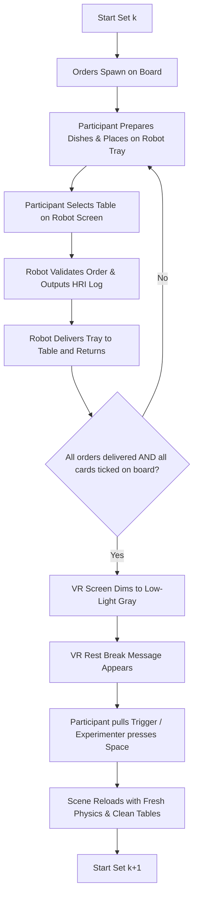

# Café HRI Experiment & Order Setup Guide

This guide is designed for researchers and experimenters managing VR trial runs in the **Café Social Robotics** project. It explains how to configure orders, set up multi-set trials, operate experimenter keyboard shortcuts, and customize session settings.

---

## Table of Contents
1. [Overview of the System](#1-overview-of-the-system)
2. [Order Setup ($N$ Sets $\times$ $M$ Orders)](#2-order-setup-n-sets-times-m-orders)
3. [Experiment Session Settings (`ExperimentSessionManager`)](#3-experiment-session-settings-experimentsessionmanager)
4. [Trial Workflow & Transition Logic](#4-trial-workflow--transition-logic)
5. [Operator / Experimenter Keyboard Controls](#5-operator--experimenter-keyboard-controls)
6. [Saving & Resetting Progress (`PlayerPrefs`)](#6-saving--resetting-progress-playerprefs)
7. [Adding New Dish Types](#7-adding-new-dish-types)

---

## 1. Overview of the System

During each trial session, the participant stands in VR behind the café counter:
- **Order Cards** appear on the order display board at configured spawn intervals.
- The participant prepares the requested food items and places them onto the **Delivery Robot's tray**.
- The participant presses a **Table Button** on the robot to dispatch it to the destination table.
- The delivery robot validates the delivery and logs a structured **`[HRI Log]`** in the Unity console.
- Once all orders in the set are fulfilled, the robot finishes delivery, and the participant ticks off all cards on the board:
  - The scene **smoothly dims to a comfortable low-light gray**.
  - A **rest break message** appears in VR.
  - The scene **reloads cleanly** for the next trial set (resetting dishes, robot joints, and tables).

---

## 2. Order Setup ($N$ Sets $\times$ $M$ Orders)

### Where to Find it in Unity:
In the **Hierarchy** window, navigate down the following path:
```text
Cafe_1
 └── Bar
      └── FFK_Register_Unpacked
           └── OrderScreenUI
                └── OrderCanvas
                     └── Panel   <-- (Select this GameObject)
```
On the **`Panel`** GameObject, look at the **`Order Manager (Script)`** component in the **Inspector**:

```text
▼ Trial Setup
  ▶ Order Sets                   [ 5 ]
    ▼ Element 0 (Set 1)
      Set Name                   [ Set 1 - Baseline ]
      ▼ Orders                   [ 6 ]
        ▼ Element 0
          Order Title            [ Order 1 ]
          Target Table Index     [ 0 ]   <-- (0 = Table 1, 1 = Table 2, etc.)
          ▼ Required Items       [ 2 ]
            = Element 0          [ Burger ]
            = Element 1          [ Espresso ]
          Display Description    [ 1x Burger, 1x Espresso ]
```

### Step-by-Step Configuration:
1. **Set Count ($N$)**: Set the size of **`Order Sets`** (e.g., `5` for 5 sets).
2. **Orders per Set ($M$)**: Under each `Element` (Set), set the size of **`Orders`** (e.g., `6` for 6 orders per set).
3. **Order Parameters**:
   - **`Order Title`**: Name of the order (e.g., `"Order 1"`, `"Table 2 Quick Lunch"`).
   - **`Target Table Index`**:
     - `0` $\rightarrow$ **Table 1** (WaypointTable1)
     - `1` $\rightarrow$ **Table 2** (WaypointTable2)
     - `2` $\rightarrow$ **Table 3** (WaypointTable3)
     *(Note: Internally indexed starting from 0, but automatically displayed to the VR user as Table 1, Table 2, Table 3, etc.)*
   - **`Required Items`**: Select the items expected on the tray (e.g., `Burger`, `Burger`, `Espresso`).
   - **`Display Description`**: *(Optional)* Custom multi-line text shown on the VR card. If left blank, it lists the required items automatically.

### Randomization & Timing Settings:
- **`Randomize Set Order`**: If `true`, the 5 sets appear in a randomized order.
- **`Randomize Orders Within Sets`**: If `true`, the 6 individual orders inside each set are shuffled in sequence.
- **`Randomize Table Assignments`**:
  - **`false` (Default - Fixed Tables)**: Orders are delivered to whichever table they were explicitly assigned to in the Inspector (`Target Table Index`).
  - **`true` (Randomized Tables)**: Table numbers are randomly distributed across the $M$ orders for that set.
- **`Available Table Indices`**: *(Optional)* List of table indices to assign from (e.g. `0, 1, 2, 3, 4, 5` for Tables 1 to 6).
  - If you leave this list **empty**, it will shuffle the existing table numbers defined across the orders in the set.
  - If you populate this list with specific table numbers, each order randomly draws from these tables.
- **`Random Seed`**:
  - `0`: Generates a new random order/table distribution every time.
  - Any non-zero number (e.g., `42`, `101`): Produces the **exact same pseudo-random sequence** across multiple participants in a condition group.
- **`Spawn Interval`**: Number of seconds between order cards appearing on the order board (e.g., `10.0` seconds).

---

## 3. Experiment Session Settings (`ExperimentSessionManager`)

Select the **`ExperimentSessionManager`** GameObject in the Hierarchy:

| Setting | Default Value | Description |
| :--- | :--- | :--- |
| **`Subject ID`** | `Subject_01` | String identifier for the participant (used for data logging). |
| **`Current Set Index`** | `0` | Current active trial set (`0` = Set 1, `1` = Set 2, etc.). |
| **`Save To Player Prefs`** | `false` *(OFF)* | **Off by default**. Every time you press Play in the Editor, it starts fresh from Set 1 (or the configured `Current Set Index`). If turned `true`, it saves progress permanently across Editor restarts. |
| **`Fade Duration`** | `1.0` | Duration (in seconds) for the low-light dimming transition. |
| **`Min Break Duration`** | `3.0` | Minimum rest time (in seconds) the participant spends in low-light before being allowed to proceed. |
| **`Require Input To Proceed`** | `true` | If `true`, waits for the participant to pull their **VR Controller Trigger** (or the experimenter to press **`[Space]`**) before loading the next set. |

---

## 4. Trial Workflow & Transition Logic



### When Does the Dimming / Set Transition Happen?
The set transition and dimming will **only** trigger when all of the following conditions are met:
1. **Order List is Empty**: The VR participant has ticked off all order cards on the order board (`activeOrders.Count == 0`).
2. **All Deliveries Initiated**: The robot has received all $M$ delivery dispatches for the set.
3. **Robot Delivery Completed**: The robot has arrived at the table, placed the tray down, and returned to the bar (`isActivelyDelivering == false`).

---

## 5. Operator / Experimenter Keyboard Controls

While seated at the host computer, the experimenter can control the trial using the keyboard at any time:

| Key Binding | Action | What It Does |
| :--- | :--- | :--- |
| **`[Space]`** or **`[N]`** | **Continue Break / Skip Rest** | Advances from the rest break into the next trial set immediately. |
| **`[Ctrl] + [N]`** | **Force Next Set** | Force-ends the current gameplay set and jumps to the next set. |
| **`[R]`** | **Restart Current Set** | Resets the scene cleanly to the beginning of the *current* set. |
| **`[Backspace]`** or **`[Delete]`** | **Reset to Set 1** | Resets participant trial progress back to Set 1 (Index 0). |
| **`[Ctrl] + [1]` to `[9]`** | **Jump to Set 1 – 9** | Instantly reloads the environment into the chosen set number. |

---

## 6. Saving & Resetting Progress (`PlayerPrefs`)

> [!NOTE]
> **`Save To Player Prefs` is turned OFF by default (`false`)**.  
> In this default mode, every time you start Play mode in Unity, it starts fresh from Set 1 (or whatever `Current Set Index` is set to in the Inspector). You do not need to worry about clearing or resetting saved data.

### If you turn `Save To Player Prefs = true`:
Progress will be saved in the Windows Registry across Unity Editor restarts. To reset the progress back to **Set 1 (Index 0)**:
- **Method A (Inspector Context Menu)**: In the Inspector, **Right-Click** the `ExperimentSessionManager` header $\rightarrow$ Select **`Reset Progress to Set 1 (Index 0)`**.
- **Method B (Keyboard)**: While in Play mode, press **`[Backspace]`** or **`[Delete]`** on the keyboard.
- **Method C (Unity Top Menu)**: Go to **`Edit`** $\rightarrow$ **`Clear All PlayerPrefs`**.

---

## 7. Adding New Dish Types

To add a new food or drink item to the café menu:

1. Open [`Assets/Scripts/DishItem.cs`](file:///c:/Users/g/Documents/Cafe_Social_Robotics/Assets/Scripts/DishItem.cs).
2. Add the item name to the `ItemType` enum:
   ```csharp
   public enum ItemType
   {
       Burger,
       Espresso,
       Donut,
       Cappuccino,
       Croissant,
       Flatbread,
       Water,
       Schokobrotchen,
       Milch,
       MatchaLatte,   // <-- Add new item here
       Cheesecake     // <-- Add new item here
   }
   ```
3. Attach the **`Dish Item`** component to your food prefab/object and select your new item in the dropdown.
4. It will now automatically appear in the `Required Items` dropdown inside `OrderManager`!
